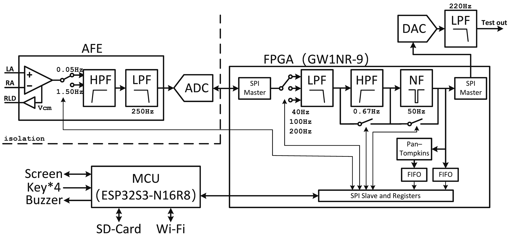

# 目录
- [1. 前情回顾](#1前情回顾)
- [2. 目标与意义](#2目标与意义)
  - [2.1. 目标](#21目标)
  - [2.2. 意义](#22意义)
- [3. 心电测量原理](#3心电测量原理)
  - [3.1. 信号基本特征](#31信号基本特征)
  - [3.2. 十二导联体系](#32十二导联体系)
  - [3.3. 电极与电极模型](#33电极与电极模型)
  - [3.4. 噪声来源](#34噪声来源)
- [4. 整体架构](#4整体架构)

# 1.前情回顾

  

2024年1月，俺萌生了制作心电放大电路的想法。此前从未接触微弱信号相关项目，因此对从噪声中提取心电信号充满新奇（

又过了两个月，刚好有朋友也要做这个，要求是不使用现成AFE芯片，而是用运放搭建。于是一拍即合，决定陪他试试。

先是用INA826和TL072在覆铜板上“潦草”地试了试，信号来得比想象容易，但波形不对——排除自身健康问题后找到原因：高通截止频率过高或示波器开了AC耦合。

后来又尝试做了个更精致点的模块（（

    

再后来又想尝试搓12导联，前端依然用运放搭建，并希望性能尽量满足IEC标准。但很快“弃坑”了，感觉题目定大了，软硬件设计和性能测试要花很多精力，结坑遥遥无期（

# 2.目标与意义

## 2.1.目标

于是重新考虑目标和需求：不再追求用运放搭建尽量完备的心电图机。新的目标是电生理记录仪，对标科研场景的生物电信号采集：

### 核心目标

1. 前端带宽0.05–200Hz，同时提供多挡位数字滤波，适应ECG、EMG、EEG等不同场景（虽然只有一个通道💦）；
2. 关注系统噪声、共模抑制比和输入阻抗；
3. 屏幕实时显示波形、心率和心率变异性；
4. 数据可保存为CSV和BDF格式到SD卡，并可在网页端下载；

### 明确放弃

1. 单通道设计，不考虑对标心电图仪的要求（电轴解算和诊断算法、除颤防护、导联脱落检测、起搏信号检测等）；
2. 不涉及电脑上位机；
3. USB供电，不考虑低功耗。

## 2.2.意义

项目的意义更多在于学习和兴趣。

市面上已有多种成熟的AFE解决方案，例如ADI的ADAS1000、TI的ADS129x系列，以及国产厂商如领慧立芯和类比半导体的产品。

一颗AFE芯片通常就能处理大部分硬件任务，用运放手动搭建多半只算“重复造轮子”。但世上没有两个完全一样的轮子——自己做的虽然笨拙，却“独一无二”。在这个过程中会遇到各种问题，而正是解决这些问题的过程带来了乐趣，也顺便积累一点测量类项目的经验🤤。

写文的意义则在于分享和记录，能力有限，肯定多有不足，欢迎交流指正欸。

# 3.心电测量原理

这部分着重工程内容，不深入医学细节。

## 3.1.信号基本特征

一个典型的ECG波形由P波、QRS波群、T波组成，50%～75%的ECG中还可能出现U波。

ECG幅度范围为100μV～3mV峰峰值，**典型值为1mV**。

[AHA](https://www.ahajournals.org/doi/10.1161/CIRCULATIONAHA.106.180200)建议诊断性带宽应至少为**0.05–150Hz**。低频响应不足会导致ST段失真；0.05Hz的低频截止频率无法消除基线漂移，而采用线性相位数字滤波器可将低频截止放宽至0.67Hz。高频响应不足则会造成信号幅值低估，并使切迹和Q波被错误平滑。成人、青少年和儿童至少需要150Hz的高频截止，而婴儿更适合250Hz的高频截止频率。

## 3.2.十二导联体系

>因为时间和精力有限，这个**项目只做了单导联**💦，这里还是把十二导联的内容整理一下。

导联是指电极在身体上的摆放位置以及它们怎么跟放大器连接的一套规则。

标准十二导联心电图包括三组：**标准肢体导联**（I、II、III）、**加压肢体导联**（aVR、aVL、aVF）和**胸导联**（V1～V6）。

一共要用**10个电极**：左臂（LA）、右臂（RA）、左腿（LL）、右腿（RL）各一个，胸部再放6个（V1～V6）。右腿电极一般用作参考地，由共模信号或威尔逊中心端驱动，其他9个电极通过多路开关选通后接入放大器。

### 3.2.1.标准肢体导联（I、II、III）

标准肢体导联（I、II、III）属于双极导联，测量的是两个肢体之间的电位差。它们的定义是：

- $$V_I=V_{LA}-V_{RA}$$；
-  $$V_{II}=V_{LL}-V_{RA}$$；
-  $$V_{III}=V_{LL}-V_{LA}$$。

由于任意时刻都有 $V_{II}= V_{I}+V_{III}$ ，实际设计中我们只需要测出其中两个，第三个就可以得到。

### 3.2.2.加压肢体导联（aVR、aVL、aVF）

和标准导联不同，加压导联属于单极导联，测的是某个肢体电极相对于参考点（威尔逊中心端）的电压。威尔逊中心端由 RA、LA、LL 三个电极各接一个相等大小的电阻构成，电位为：  $V_{WT}=\frac{1}{3}(V_{RA}+V_{LA}+V_{LL})$ ，相当于身体的平均电位。

但这样测出来的信号幅值较小，因为参考端里混进了被测肢体本身的信号。如果把对应肢体的电阻拿掉，幅度就能增加50%——所以叫“加压”肢体导联（aVR、aVL、aVF，a源自augmented）。这三者定义是：

- $$V_{aVR}=V_{RA}-\frac{1}{2}(V_{LA}+V_{LL})$$；
- $$V_{aVL}=V_{LA}-\frac{1}{2}(V_{RA}+V_{LL})$$；
- $$V_{aVF}=V_{LL}-\frac{1}{2}(V_{RA}+V_{LA})$$。

它们也可以用标准导联换算出来：

- $$V_{aVR}=-\frac{1}{2}(V_{I}+V_{II})$$；
- $$V_{aVL}=V_{I}-\frac{1}{2}V_{II}$$；
- $$V_{aVF}=V_{II}-\frac{1}{2}V_{I}$$。

工程上有一个“取巧”的做法：既然只要测两个标准导联就能推算出所有6个肢体导联（I、II、III、aVR、aVL、aVF），那就不需要频繁切换导联——单个低速ADC分时复用也能实现多导联同步显示。

[AHA](https://www.ahajournals.org/doi/10.1161/CIRCULATIONAHA.106.180200#:~:text=In%20practice%2C%20modern%20electrocardiographs%20measure,be%20important%20to%20clinical%20interpretation.)也认可这种方式，指出加压肢体导联本质是衍生出来的、是冗余的——但它们提供了观察心电活动的不同视角，临床中仍然保留。标准+加压这六个导联统称为额面（frontal plane）导联，反映心脏上下和左右的电活动。

### 3.2.3.胸导联（V1–V6）

胸导联也属于单极导联，是把电极放在胸壁特定位置，参考电极仍是威尔逊中心端。每个胸导联的电压为：

$$V_{n}' = V_{n} - \frac{1}{3} (V_{RA} + V_{LA} + V_{LL}) \quad (n = 1,2,\cdots,6)$$ 。

胸导联反映的是前后和左右方向的心电活动，所以也叫横面（horizontal plane）导联。最重要的是：**这六个胸导联无法通过其他导联准确换算**，每个都得独立测量。

### 3.2.4.导联数与ADC通道数关系

<table>
  <thead>
    <tr>
      <th align="center">导联数</th>
      <th align="center">导联名称</th>
      <th align="center">所需电极数</th>
      <th align="center">所需ADC通道数</th>
    </tr>
  </thead>
  <tbody>
    <tr>
      <td align="center">1</td>
      <td align="center">Lead I</td>
      <td align="center">3</td>
      <td align="center">1</td>
    </tr>
    <tr>
      <td align="center">6</td>
      <td align="center">Lead I, Lead II, Lead III, avR, aVL, aVF</td>
      <td align="center">4</td>
      <td align="center">2</td>
    </tr>
    <tr>
      <td align="center">12</td>
      <td align="center">Lead I, Lead II, Lead III, avR, aVL, aVF, V1–V6</td>
      <td align="center">10</td>
      <td align="center">8</td>
    </tr>
  </tbody>
</table>

总结一下，1个ADC通道只能采单导联，2个ADC通道就能覆盖6个肢体导联，8个ADC通道能实现完整12导联（6个肢体导联+6个胸导联）。

现代12导联ECG前端的实现原理，在ADS1298的数据手册中可以窥见一二：它配备了8个独立的ADC同步采样，同时通过灵活的输入复用器实现右腿驱动和威尔逊中心端电压的平均。

## 3.3.电极与电极模型

### 3.3.1.半电池电位与极化电位

金属电极通过导电膏或汗液等电解质与皮肤接触时，在电极-电解质界面会发生离子-电子交换反应，形成一个稳定的**半电池电位**。

当界面中有电流流过（如放大器的输入偏置电流）时，会产生极化现象并形成**极化电位**；机械运动则会扰动界面电荷分布，导致极化电位波动。极化电位的不稳定性是运动伪迹的原因之一，因此不易发生极化的电极性能更优。

半电池电位与极化电位会在放大器输入端引入较高的直流共模电压，而不同电极界面之间的直流差值则表现为失调电压。IEC标准规定ECG设备**应能耐受±300mV的直流差模输入**。

### 3.3.2.干电极与湿电极

电极一般分为两类：干电极（又称可极化电极）和湿电极（又称不可极化电极）。

干电极比较常见：肢体导联通常采用不锈钢夹子，胸导联则多用铜镀镍吸球。其优点是可重复使用，但接触阻抗和极化电压较大。

湿电极由导电凝胶和镀Ag-AgCl金属扣组成，具有较低的半电池电位（约为223 mV），几乎不产生极化，接触阻抗也更小；但导电凝胶是一次性的。

### 3.3.3.实际电极及等效模型

这里选择可重复使用的干电极。由于只做单导联，所以只买肢体夹子，再配一根屏蔽线自己加工一下就可以了（

屏蔽线是单芯的。焊接的时候，把芯线焊在电极片上，然后套上热缩管，避免和屏蔽层短路；另一端焊2p排针，同样套上热缩管，再插入2EDGK端子压紧。这样既方便插拔，线头也不容易断。建议三个电极统一接到一个6p的2EDGK端子上——实测用2p的话，插上去容易晃动。

干电极一定程度上需要依赖汗液降低接触阻抗，但实测发现，肢体出汗过多的话，夹子的效果会很差，会出现明显的直流失调电压，并更容易产生运动伪迹。

在IEC标准的共模抑制和噪声测试中，电极阻抗规定为51kΩ//47nF。由于要求能够耐受±300mV的直流差模输入，因此半电池电位设定为300mV。

实际的等效电路由两个界面组成：不仅要考虑电极-电解质界面，还要考虑皮肤-电解质界面。在皮肤-电解质界面，表皮会产生跨膜阻抗，而因表皮角质层两侧离子浓度不一致，又会形成跨膜电位——这一部分深究比较复杂。

因此，对于干电极而言，其阻抗不一定等于51kΩ//47nF：出汗情况、接触压力等因素会显著影响，阻抗范围可能从kΩ到MΩ不等。**但这里为了方便起见，还是按照51kΩ//47nF进行设计。**

## 3.4.噪声来源

### 3.4.1.共模干扰

人体如同天线，会拾取工频和EMI等共模干扰，而电极接触阻抗的不一致会将这些干扰转化为差模信号进入电路。解决方法主要有几种：

- 用右腿驱动来抵消共模干扰，同时给屏蔽线添加Guard驱动；
- 模拟前端与数字部分电气隔离，避免USB引入外部PE地的工频干扰；
- 在仪表放大器输入端加入X2Y结构进行RFI滤波，并选择高CMRR的仪表放大器；
- 测试前清洁或打磨表皮角质层，降低电极接触阻抗的失配；
- 添加模拟或数字工频陷波器；不过要注意，陷波器会引入失真，而且IEC标准要求在测试CMRR时关闭陷波器。

这一部分在后面的硬件章节会进一步说明。

### 3.4.2.基线漂移

也叫“运动伪迹”，主要由呼吸或身体移动导致电极与皮肤间发生相对位移所引起。常见的处理方法有：

- 用滑动平均提取低频成分再从原信号中减去，相当于线性相位的高通滤波；
- 高通滤波截止频率在0.67Hz至2Hz，截止频率高抑制效果好，但会引起ST段失真，需要折中；
- 小波或形态学滤波，但在FPGA上实现比较困难。

这里预置了0.67Hz的IIR高通滤波器，缺点是存在相位失真，但FIR低截止频率需要的阶数比较多。最现实的办法还是：让被测者安静平躺、尽量保持不动，同时优先使用Ag-AgCl湿电极。

### 3.4.3.肌电干扰

肌电干扰是宽带随机信号，主要能量集中在20-500Hz，与心电信号频段重叠，因此无法靠简单滤波完全去除。缩小带宽到40Hz可以有所改善，但会带来信号失真。其他方法比较复杂，比如主成分分析、多导联盲源分离。

最现实的办法还是不做后期，测量时平躺，手臂自然放置，保持肌肉放松，别出力（

# 4.整体架构

    

项目主要由FPGA和MCU两部分组成：  

- **模拟前端**：完成信号放大和初步滤波。
- **FPGA**：采集ADC数据，并进行数字滤波及R波检测（Pan-Tompkins算法）。  
  - 数字滤波包括三档可调低通滤波（40/100/200Hz）、0.67Hz高通滤波以及50Hz工频陷波器；高通滤波和陷波器可按需关闭。
  - 数据分别写入FIFO：滤波后的数据流、R波检测得到的RR间期值（毫秒）。
  - 控制DAC输出滤波后的波形，方便直接观察和调试。
- **MCU**：通过SPI从FIFO读取数据，并向FPGA发送命令控制滤波器；同时负责完成人机交互和数据存储。  

>老实说，ESP32S3-N16R8的性能和内存可能足以处理低速信号，加入FPGA在成本上不够“优雅”（   
>但还是想借这个项目尝试FPGA：一方面是出于学习目的，另一方面也使实现更容易。    FPGA天生适合实时信号处理，也更便于驱动AD/DA。单片机则可腾出手专注UI等上层任务。如果完全依赖单片机实现，可能需要在程序优化上投入更多精力。

